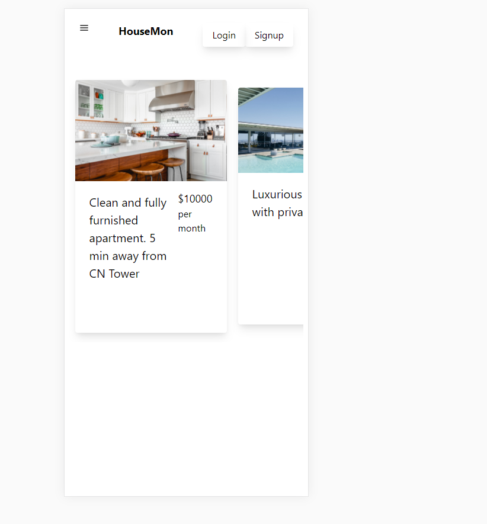

# Housemon  Renting Webapp

Housemon is app which allows the user to look for rental houses and allow them to add the houses in their favourite list ,so the renting become easy for users!

This is the frontend part of the application in order to see the api part of this application please visit [Here](https://github.com/shubhsk88/house-renting-api)
## Live Demo

[View Live Demo](https://pokedexi.netlify.app/)

## Screenshots

## Features & Usage

- A list of houses will be shown to the users in the default page
- A user can login and signup using name and username
- A user can see the description of the hotel by clicking onn the card

- User can navigate back to the home page by clicking on the home button
- User can add the hotel in their favourite list by click on the description for the button

## Potential Features

- Authentication

## Setup

1. Clone this repository and access the project's directory.
2. Run "yarn install".

3. Run "yarn start" to work on the development server.

## Built With

- JavaScript/ES6

- React
- React Hooks
- React Router
- Redux
- Tailwind CSS
- React Redux
- Pokeapi
- Netlify

## Author

👤 **Shubham Singh**

- Github: [@shubhsk88](https://github.com/shubhsk88)
- Twitter: [@shubhski](twitter.com/shubski)
- Linkedin: [linkedin](https://www.linkedin.com/in/shubhski/)

## 🤝 Contributing

Contributions, issues and feature requests are welcome!

Feel free to check the [issues page](https://github.com/shubhsk88/house-rent-fe/issues).

## Show your support

Give a ⭐️ if you like this project!
